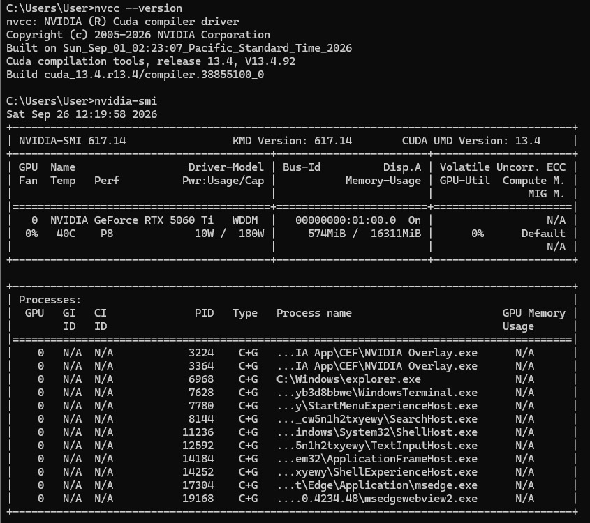

# Parallel & GPU Computing Lab

## 4000 × 4000 Matrix Multiplication Performance Analysis

A comparative implementation and performance study of **4000 × 4000 matrix multiplication** using four computing approaches:

- **Sequential C**
- **OpenMP**
- **MPI**
- **CUDA**

The project compares execution time, speedup, and computational throughput across CPU shared-memory, distributed-memory, and GPU-based implementations.

---

## Table of Contents

1. [Executive Summary](#executive-summary)
2. [Project Objectives](#project-objectives)
3. [Problem Definition](#problem-definition)
4. [Architectural Implementations](#architectural-implementations)
5. [Experimental Configuration](#experimental-configuration)
6. [Performance Benchmarks](#performance-benchmarks)
7. [Performance Analysis](#performance-analysis)
8. [Visualizations](#visualizations)
9. [Source Code and Execution](#source-code-and-execution)
10. [Repository Structure](#repository-structure)
11. [Verification Results](#verification-results)
12. [Architecture Comparison](#architecture-comparison)
13. [Reproducibility](#reproducibility)
14. [Conclusion](#conclusion)

---

## Executive Summary

This project implements matrix multiplication for a **4000 × 4000 matrix** using four different programming models.

| Implementation | Execution Time | Speedup | GFLOPS | Result |
|---|---:|---:|---:|---:|
| Sequential C | 348.02 s | 1.00× | 0.37 | 4000.00 |
| OpenMP | 132.46 s | 2.63× | 0.97 | 4000.00 |
| MPI | 92.98 s | 3.74× | 1.38 | 4000.00 |
| CUDA | 0.165 s | 2109.18× | 775.74 | 4000.00 |

The same computational problem is therefore evaluated using sequential execution, shared-memory parallelism, distributed-memory parallelism, and GPU acceleration.

---

## Project Objectives

The main objectives are:

- Implement matrix multiplication using Sequential C.
- Parallelize the computation using OpenMP.
- Distribute the computation using MPI.
- Accelerate matrix multiplication using CUDA.
- Measure execution time for each implementation.
- Calculate speedup relative to the sequential implementation.
- Compare computational throughput in GFLOPS.
- Verify that all implementations produce the expected result.
- Present the experimental results using graphs and screenshots.

---

## Problem Definition

Matrix multiplication is a computationally intensive operation.

For matrices:

\[
C = A \times B
\]

each element is calculated as:

\[
C[i][j] = \sum_{k=0}^{N-1} A[i][k]B[k][j]
\]

For **N = 4000**, the computation requires approximately:

\[
2N^3 = 128 \times 10^9
\]

floating-point operations.

The project investigates how different execution architectures affect the time required to perform this computation.

---

# Architectural Implementations

## 1. Sequential C

The sequential implementation performs matrix multiplication on a single CPU execution path.

### Characteristics

- Baseline implementation
- No parallel processing
- Used as the reference for speedup calculations
- Compiled using GCC

### Compilation

```bash
gcc -O2 src/sequential/matrix_sequential.c -o sequential
```

### Execution

```bash
./sequential
```

### Output Verification


---

## 2. OpenMP

OpenMP uses shared-memory parallelism to distribute matrix multiplication across multiple CPU threads.

The experiment uses:

```bash
export OMP_NUM_THREADS=8
```

### Compilation

```bash
gcc -O2 -fopenmp src/openmp/matrix_openmp.c -o openmp
```

### Execution

```bash
export OMP_NUM_THREADS=8
./openmp
```

### Output


### CPU Thread Utilization


---

## 3. MPI

MPI uses distributed-memory parallelism. The matrix computation is divided between multiple MPI processes.

### Compilation

```bash
mpicc -O2 src/mpi/matrix_mpi.c -o mpi_matrix_mul
```

### Execution

```bash
mpirun -np 4 ./mpi_matrix_mul
```

For a configured host file:

```bash
mpirun --hostfile hostfile -np 4 ./mpi_matrix_mul
```

### MPI Communication


### MPI Result


---

## 4. CUDA

CUDA executes the matrix multiplication on an NVIDIA GPU.

### Compilation

```bash
nvcc -O2 src/cuda/matrix_cuda.cu -o cuda_matrix_mul
```

### Execution

```bash
./cuda_matrix_mul
```

CUDA provides massive parallelism because many matrix elements can be calculated concurrently on the GPU.
### CUDA Environment


### CUDA Source Code


### CUDA Result


---

# Experimental Configuration

| Parameter | Value |
|---|---|
| Matrix size | 4000 × 4000 |
| Operation | Matrix multiplication |
| Sequential | C |
| Shared-memory parallelism | OpenMP |
| Distributed-memory parallelism | MPI |
| GPU acceleration | CUDA |
| OpenMP threads | 8 |
| MPI processes | 4 |
| Verification value | C[0][0] = 4000.00 |

---

# Performance Benchmarks

## Overall Performance

| Implementation | Time (s) | Speedup | GFLOPS |
|---|---:|---:|---:|
| Sequential | 348.02 | 1.00× | 0.37 |
| OpenMP | 132.46 | 2.63× | 0.97 |
| MPI | 92.98 | 3.74× | 1.38 |
| CUDA | 0.165 | 2109.18× | 775.74 |

### Execution Time


### Speedup


### GFLOPS Throughput


### Matrix Scaling / Architecture Comparison


### Combined Performance Comparison


---

# Performance Analysis

## Execution Time

The measured execution times show a substantial reduction as parallelism and specialized hardware are introduced.

- Sequential: **348.02 seconds**
- OpenMP: **132.46 seconds**
- MPI: **92.98 seconds**
- CUDA: **0.165 seconds**

The CUDA implementation has a dramatically lower measured execution time in this experiment.

## Speedup

Speedup is calculated relative to the sequential implementation:

\[
Speedup = \frac{T_{sequential}}{T_{parallel}}
\]

Measured speedups:

- OpenMP: **2.63×**
- MPI: **3.74×**
- CUDA: **2109.18×**

## GFLOPS

The measured throughput values are:

- Sequential: **0.37 GFLOPS**
- OpenMP: **0.97 GFLOPS**
- MPI: **1.38 GFLOPS**
- CUDA: **775.74 GFLOPS**

These values illustrate the difference between general-purpose CPU execution and massively parallel GPU execution for this workload.

---

# Visualizations

The repository contains generated charts for:

1. Execution time
2. Speedup
3. GFLOPS throughput
4. Architecture comparison
5. Combined performance comparison

All charts are stored in the `images/` directory and are embedded directly in this README.

---

# Source Code and Execution

## Sequential

```bash
gcc -O2 src/sequential/matrix_sequential.c -o sequential
./sequential
```

## OpenMP

```bash
gcc -O2 -fopenmp src/openmp/matrix_openmp.c -o openmp
export OMP_NUM_THREADS=8
./openmp
```

## MPI

```bash
mpicc -O2 src/mpi/matrix_mpi.c -o mpi_matrix_mul
mpirun -np 4 ./mpi_matrix_mul
```

Optional host-file execution:

```bash
mpirun --hostfile hostfile -np 4 ./mpi_matrix_mul
```

## CUDA

```bash
nvcc -O2 src/cuda/matrix_cuda.cu -o cuda_matrix_mul
./cuda_matrix_mul
```

---

# Repository Structure

```text
pgc/
│
├── README.md
├── .gitignore
├── generate_charts.py
│
├── images/
│   ├── execution_time_chart.png
│   ├── speedup_chart.png
│   ├── gflops_throughput_chart.png
│   ├── matrix_scaling_chart.png
│   ├── performance_comparison_charts.png
│   ├── sequential.png
│   ├── openmp.png
│   ├── openmp_htop.png
│   ├── mpi_ping.png
│   ├── mpi_send_recv.png
│   └── mpi_result.png
│
└── src/
    ├── cuda/
    │   └── matrix_cuda.cu
    │
    ├── mpi/
    │   ├── matrix_mpi.c
    │   └── mpi_send_recv.c
    │
    ├── openmp/
    │   └── matrix_openmp.c
    │
    └── sequential/
        └── matrix_sequential.c
```

---

# Verification Results

All implementations use the same matrix multiplication problem and verify the resulting matrix.

The expected verification value used in the benchmark is:

```text
C[0][0] = 4000.00
```

## Sequential Verification


## OpenMP Verification


## MPI Verification


---

# Architecture Comparison

| Feature | Sequential C | OpenMP | MPI | CUDA |
|---|---|---|---|---|
| Execution model | Sequential | Shared memory | Distributed memory | GPU parallel |
| Processing unit | CPU | CPU cores/threads | Multiple MPI processes | GPU threads |
| Parallelism | None | Thread-level | Process-level | Massive thread-level |
| Memory model | Shared CPU memory | Shared memory | Distributed memory | GPU device memory |
| Main tool | GCC | GCC + OpenMP | MPI | NVIDIA CUDA |
| Experimental time | 348.02 s | 132.46 s | 92.98 s | 0.165 s |
| Speedup | 1.00× | 2.63× | 3.74× | 2109.18× |
| GFLOPS | 0.37 | 0.97 | 1.38 | 775.74 |

---

# Reproducibility

To reproduce the experiment:

### 1. Clone the repository

```bash
git clone <YOUR_GITHUB_REPOSITORY_URL>
cd <YOUR_REPOSITORY_NAME>
```

### 2. Compile and run Sequential C

```bash
gcc -O2 src/sequential/matrix_sequential.c -o sequential
./sequential
```

### 3. Compile and run OpenMP

```bash
gcc -O2 -fopenmp src/openmp/matrix_openmp.c -o openmp
export OMP_NUM_THREADS=8
./openmp
```

### 4. Compile and run MPI

```bash
mpicc -O2 src/mpi/matrix_mpi.c -o mpi_matrix_mul
mpirun -np 4 ./mpi_matrix_mul
```

### 5. Compile and run CUDA

```bash
nvcc -O2 src/cuda/matrix_cuda.cu -o cuda_matrix_mul
./cuda_matrix_mul
```

### 6. Generate charts

```bash
python3 generate_charts.py
```

---

# Academic Observations

The experiment demonstrates four different approaches to parallel computation:

- **Sequential C** establishes the baseline performance.
- **OpenMP** improves performance by using multiple CPU threads in a shared-memory environment.
- **MPI** distributes computation among multiple processes and can extend across multiple machines.
- **CUDA** exploits large-scale GPU parallelism and provides very high throughput for this matrix workload.

The results also demonstrate that execution time and throughput depend strongly on the architecture and programming model used.

---

# Conclusion

This project provides a practical comparison of sequential, shared-memory, distributed-memory, and GPU-based matrix multiplication.

For the measured 4000 × 4000 workload, the recorded execution times were:

```text
Sequential : 348.02 s
OpenMP     : 132.46 s
MPI        : 92.98 s
CUDA       : 0.165 s
```

The experiment demonstrates how different parallel programming models can be applied to the same computational problem and how their measured performance can differ substantially.

---

## Technologies Used

- C
- OpenMP
- MPI
- CUDA
- GCC
- NVIDIA CUDA Toolkit
- Python
- Git & GitHub

---

## Project Type

**Parallel and GPU Computing Laboratory Project**

**Workload:** 4000 × 4000 Matrix Multiplication

**Implementations:** Sequential C, OpenMP, MPI, CUDA
